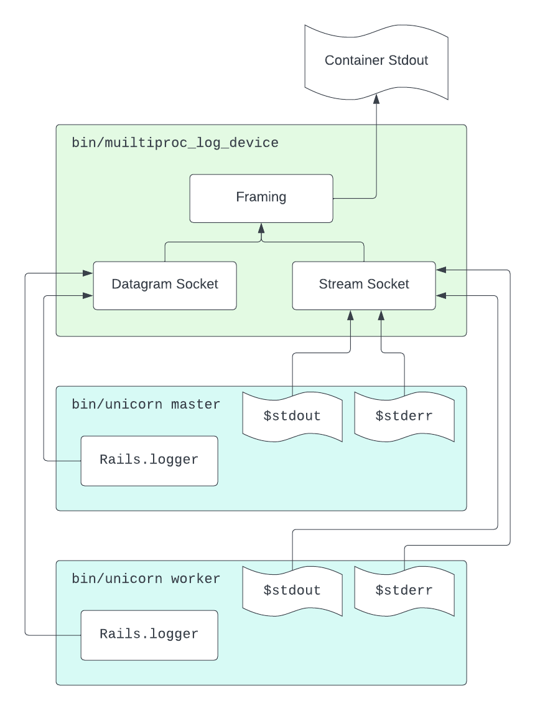

# multiproc_log_device

Safely log from multiple processes to a shared output stream. Designed to support stdout-based logging schemes for Unicorn & Puma apps run in containers.

## Quickstart

* Add `multiproc_log_device` to your application's `Gemfile`, and then run

    ```ruby
    bundle install
    ```

* Add the binstub for the `multiproc_log_device` collector:

    ```ruby
    bundle binstubs multiproc_log_device
    ```

  This will create a `bin/multiproc_log_device` file in your application, which you should check into source control.

* Instead of directly starting your application, invoke it through `bin/multiproc_log_device` instead. For example, if you normally start your app through

    ```ruby
    bin/unicorn -c config/unicorn.rb
    ```

  You would instead run

    ```ruby
    bin/multiproc_log_device [options] -- bin/unicorn -c config/unicorn.rb
    ```

* When your application forks, reopen `$stdout` and `$stderr` to point to new streams. For example, with Unicorn, add something like the following to your Unicorn configuration:

    ```ruby
    require 'multiproc_log_device'
    after_fork do
      $stdout.reopen MultiprocLogDevice::StreamDevice.new(attributes: {pid: Process.pid, stream_type: 'stdout'})
      $stderr.reopen MultiprocLogDevice::StreamDevice.new(attributes: {pid: Process.pid, stream_type: 'stdout'})
    end
    ```

## What is this gem for?

### Container-based logging pipelines

It's common for applications designed for container environments such as Kubernetes to emit their log output to the standard output stream. This pattern is explicitly recommended in the Kubernetes [documentation](https://kubernetes.io/docs/concepts/cluster-administration/logging/#basic-logging-in-kubernetes), for example. Kubernetes deployments will often have a logging agent deployed to the cluster which takes these container standard output logs and ships them off to a central logging service, such as Datadog, Splunk, or an Elasticsearch instance.

When using these kinds of central log aggregators, we need more structure than simply the raw text of the log message to find the log entries we're looking for. The logging agent will normally enrich the raw log lines it receives from application standard output streams with information such as the host, application, and container ID of the process that generated the log. That makes it possible to query for e.g. log lines coming from a specific host or service.

It's also useful to be able to extract this kind of structured data from the log message itself, by parsing the text of the message. For example, a logging agent might see a message like `I, [2024-01-11T15:02:37.613919 #92413]  INFO -- : hello` (in Ruby's `Logger` default format), and deduce that this log has a `timestamp` of `2024-01-11T15:02:37` and a level of `INFO`. These are also important facets to be able to query logs over.

Many of the attributes we might want to search for logs with, however, are _really_ known only to the application itself - for example things like a user ID or a request ID. For the application to include this information in a way that gets indexed properly in the central log collector, it and the log agent must agree on a common format for conveying these attributes - for example, your application might emit log entries to stdout as JSON objects like so:

```
{"time": "2024-01-02T00:00:01Z", "level": "INFO", "user_id": 123, "message": "Logging in"}
{"time": "2024-01-02T00:00:01Z", "level": "INFO", "user_id": 123, "message": "Changing user's name to 'Capn Crunch'"}
```

With an application which emits such structured log information, a logging agent which understands how to parse it, and a log aggregation service which can index along these facets, it becomes possible to construct queries that drill down on particular events of interest; for example, "find all logs about user_id 123 generated by the ordering application", or "show error level logs from today for the warehousing application".

### Standard input and output streams in containers

When the first process in a container starts in Kubernetes, it will have two pipes open (for writing), as file descriptors 1 and 2 (stdout and stderr). The reading side of these pipes will be held by the container runtime (e.g. `containerd`), which will forward the log messages somewhere appropriate (e.g. to `journald`, or JSON log files, for example) and make sure Kubernetes knows about them (so the logging agent can find them, and so the `kubectl logs` command can work).

If that process spawns another process, by default, its open file descriptors (including stdout and stderr!) will be _inherited_ by the child. That means that log messages written to stdout by either process both get sent into the same pipe, and read by the container runtime on the other side. Moreover, the reading side has no way to know _which_ process wrote a particular log message into the pipe; it's all just a single merged stream of bytes as far as it knows (and thus as far as your central logging service knows too).

Running multiple application processes in the same container sharing the same stdoud and stderr pipe can become a problem for at least two reasons: non-atomic writes and confusing mixed output.

#### Non-atomic writes to pipes

The first problem with sharing stdout is that writes into a pipe are not _necessarily_ atomic. On Linux, writes of < 4k _are_ guaranteed to be atomic - that is, they cannot be interleaved with other writes. For example, consider the following program:

```ruby
pid = fork do
  $stdout.puts "from child process"
end
$stdout.puts "from parent process"
Process.waitpid2 pid
```

This might result in either the output `"from child process\nfrom parent process"`, or the output `"from parent process\nfrom child process"`. However, it won't ever print `"from chfrom parild procentprocesses\ns\n"`; both strings are < 4k, so they are guaranteed to be written into the pipe atomically.

It's fairly easy, however, to construct a log line that's > 4k, especially if you're formatting your logs as JSON. Imagine a long backtrace, a lot of attributes, or a piece of user-provided text. Thus, if you have multiple processes writing JSON logs into a single stdout pipe, you run a real risk of multiple JSON objects being _interleaved_ with each other in the output; the result will be totally unparsable by your logging agent, and the log will be dropped on the floor. This is the first problem which this gem sets out to solve.

#### Uncontrolled stderr output

The second problem with sharing stdout and stderr streams is that you don't always controll _every_ piece of output generated by your program. You might have a Ruby program, and ensure that all diagnostic output is written as JSON objects to stdout. However, the Ruby interpreter itself still writes to stderr in some circumstances - for example when printing warnings.

Of most interest though (to me, at least) is what happens when the Ruby interpreter itself crashes (because of a bug in Ruby, or perhaps in a native extension module). This generates a huge amount of output which the Ruby interpreter writes directly to stderr itself. If you have multiple processes in a container crashing at the same time (which is very much possible if the crash is caused by some common environmental factor), their crash dump output becomes hopelessly intermixed. It can become very difficult to identify a native backtrace in this mess, for example, because the same set of filenames/line numbers is printed by multiple processes into the same stream all at the same time!

This gem also sets out to solve this issue, and make it possible to see the crash dump for a single crashing process in a container. (Sidebar: Ruby 3.3+ ships with a different solution to this problem available - Ruby's crash output can be directed to a file by setting the `RUBY_CRASH_REPORT` env var).

### Why is this a Ruby problem?

Nothing in the above is specific to Ruby, but these issues with multiple processes in containers are probably more commonly encountered in Ruby environments because of the prevalent use of multiprocess app servers like Unicorn or Puma. These servers fork multiple child processes so that each can run Ruby code in parallel with the others without the hindrance of the GVL (global VM lock). However, that means that by default in containers, they share stdout and stderr amongst multiple processes as described above.

## How does this gem work?

The `multiproc_log_device` gem works by providing a collector process which wraps your normal application server (e.g. `unicorn`), and tools to connect the stdout, stderr, and other loggers from your app processes to the collector with _independent_ streams (via a distinct unix socket connection per app). The collector process is then able to intelligently merge these independent streams together into the containers single stdout output according to a framing mechanism you choose. The overall architecture looks like this:



The gem provides separate facilities for working with unstructured, stream oriented data (like Ruby warnings written to `$stderr`, for example), and structured, message-oriented data (like the kind of log messages you might produce with `Rails.logger`, for example).

### Stream device

When `bin/multiproc_log_device` starts your application's first process (e.g. the unicorn or Puma cluster-mode master process), it will set that process's stdout and stderr to two independent instances of `MultiprocLogDevice::StreamDevice`. This class is essentially just a connection to a unix socket which the collector process listens to, plus a very lightweight protocol to configure the attributes of the stream first (such as the process pid, and whether it's a connected to stdout or stderr). The collector process then redirects output from both of these streams to its _own_ stdout, according to the requested `--framing` option. For example:

```ruby
# program.rb
$stderr.puts "hello"
$stderr.puts "goodbye"
```
```
% bundle exec multiproc_log_device --framing json -- ruby program.rb
{"pid":95846,"stream_type":"stderr","message":"hello\n"}
{"pid":95846,"stream_type":"stdout","message":"goodbye\n"}
```

The collector process also exports an environment variable `MULTIPROC_LOG_DEVICE_STREAM` to the spawned process, so you can open new connections to the stream socket with different attributes. For example:

```ruby
# program.rb
require 'multiproc_log_device'
$stdout.sync = true

$stdout.puts "message 1"
$stdout.reopen MultiprocLogDevice::StreamDevice.new(attributes: {
  pid: Process.pid,
  stream_type: 'custom',
  custom_attribute_1: 'bazinga'
})
$stdout.puts "message 2"
```

```
% bundle exec multiproc_log_device --framing json -- ruby program.rb
{"pid":26404,"stream_type":"stdout","message":"message 1\n"}
{"pid":26404,"stream_type":"custom","custom_attribute_1":"bazinga","message":"message 2\n"}
```

The main reason for exporting the `MULTIPROC_LOG_DEVICE_STREAM` environment variable, however, is so that we can re-open stdout/stderr in newly forked subprocesses. For example:

```ruby
# program.rb
require 'multiproc_log_device'

pid = fork do
  $stdout.reopen MultiprocLogDevice::StreamDevice.new(attributes: {
    pid: Process.pid,
    stream_type: 'stdout',
  })
  $stdout.puts "from child"
end
$stdout.puts "from parent"

Process.waitpid2 pid
```

```
% bundle exec multiproc_log_device --framing json -- ruby program.rb
{"pid":33409,"stream_type":"stdout","message":"from child\n"}
{"pid":33408,"stream_type":"stdout","message":"from parent\n"}
```

In a real Unicorn application, you would perform this `$stdout.reopen`/`$stderr.reopen` in an `after_fork` block in your Unicorn configuration.

### Structured device

In addition to the stream socket, the `bin/multiproc_log_device` collector process also exposes a message-oriented datagram socket (`MULTIPROC_LOG_DEVICE_DGRAM`) to assist in structured logging scenarios, where the application wants to include custom attributes with each message. This can be utilised by constructing a `MultiprocLogDevice::StructuredDevice` instance, and passing attributes to its `#write` method. For example:

```ruby
# program.rb
require 'multiproc_log_device'
logdev = MultiprocLogDevice::StructuredDevice.new
logdev.write "message 1", attributes: { phase: 'startup'}
logdev.write "message 2", attributes: { phase: 'shutdown'}
```

```
% bundle exec multiproc_log_device --framing json -- ruby program.rb
{"phase":"startup","message":"message 1"}
{"phase":"shutdown","message":"message 2"}
```

In a real application, you would probably wrap this `StructuredDevice` in a custom `Logger` subclass which allowed you to pass structured logging attributes to e.g. `logger.info` calls, since neither the stdlib `Logger` class nor Rails' default logger implementation have support for custom attributes. A future version of this gem will hopefully include such an implementation itself, built on top of `StructuredDevice`.

Also note: normally, unix datagram messages are subject to a maximum size limit (around 100k or so on Linux, for example). However, `StructuredDevice` will actually work with any sized log message! This is implemented by transparently falling back to a file-descriptor passing mechanism in cases where the datagram send fails due to size limits.

### Framing

Once the `bin/multiproc_log_device` collector process has the log messages from each stream/datagram socket from its subprocess(es), it needs to merge them together and write the result to its own standard output stream. In order to differentiate where each line came from, the collector needs to "frame" the lines in some format capable of showing the structured info.

The gem comes with a few built-in framing options.

* `none` - Performs no framing at all; each line of output is written exactly how it is received from the subprocess.
* `line` - Almost equivalent to `none`, except if a partial line is read (e.g. because the `--max-line-length` option was used), it will get a newline appended to it.
* `json` - Wraps each line in JSON, including the message attributes and a special attribute called `"message"` which contains the actual log message.
* `logfmt` - Wraps each line, including attributes, according to the [logfmt](https://brandur.org/logfmt) specification (produces output like `attr=value message="reticulating splines"`)

If none of these meet your needs, you can also implement a custom framing implementation. To do so, first, use the `--require` option to make sure your custom class is loaded; then, specify the name of the class with the `--framing` option (e.g. `--require ./lib/my/custom_framing --framing My::CustomFraming`). Your custom framing class must adhere to the following protocolÚ

* `#initialize(stream, config)`: Your framing class will be constructed with two arguments; `stream` is an `IO` object which represents where the log output is supposed to go (this will normally be the collectors `$stdout` object), and `config` is the collector process's `MultiprocLogDevice::Collector::Configuration` instance.
* `#on_message(slmessage)`: This will be called for each message received either from the stream or datagram sockets. The `slmessage` argument is an instance of `MultiprocLogDevice::Protocol::StructuredLogMessage`, and contains the text of the log message (`#message_text`), user-provided attributes (`#attributes`), as well as built-in attributes owned by this gem (e.g. `#pid` and `#tid`). Your implementation should write a stringified version of the message & attributes to the `stream` IO object it was constructed with.
  * The attributes hash is always present; if there are no attributes, it will be an empty hash.
  * The distinction between string vs symbol keys is preserved when the attributes are sent from the child process to the parent.
* In the current implementation of this gem, only a single instance of your framing class will be constructed. This is an implementation detail which is subject to change, however.
* It is guaranteed that `#on_message` will not be called concurrently on different threads or fibers for the same instance of your framing class.

### Process management

The `bin/multiproc_log_device` collector script is designed to be a good citizen in a container.

* When the main subprocess that it spawned exits, it will drain any pending log messages in the socket, and then exit with the same exit code that the subprocess exited with
* If, when the subprocess exits, there are still open connections to the stream socket (because there are still child processes running, for example), then the collector will wait for up to 10 seconds for them to be closed. This is to ensure that no log output is lost in scenarios where something unexpected is happening with your application. If those sockets do not close within that time (indicating that the sub-subprocesses which opened them are still running), then the collector script will continue to exit regardless.
* The subprocess is disconnected from the controlling terminal and placed in a new process group. This means that if you ^C an instance of `multiproc_log_device`, it will follow the graceful shutdown process still rather than delivering SIGINT to both the collector and subprocess at the same time.
* If a signal is directed at the collector script, that signal is forwarded to the single subprocess it started by default. This forwarding ensures that graceful shutdown works in Kubernetes environments.
* If `--kill-pgroup` is specified, then in fact any incoming signals are forwarded at the entire subprocess _group_. This might be required if you have a particularly broken application which doesn't forward signals to _its_ subprocesses.

## CLI Options

```
Usage: multiproc_log_device [options] -- SUBCOMMAND
  Invokes the application with SUBCOMMAND and collects its logs into a single, coherent standard output stream.
    -r, --require=FILE               Require custom code into the collector process (useful for defining custom framing classes)
    -f, --framing=FRAMING            What kind of framing to wrap stdout & stderr messages with. Options include:
      json - Frame each line of stdout in a JSON object, like '{"pid": "100", "message": "foobar"}'
      none - Emit the raw lines of stdout from each subprocess without any framing. This will make it impossible to distinguish which processe emitted the line
      line - Like none, but ensures that every message always ends with a newline.
      json - Wrap each line of output in a JSON object with its attributes.
      logfmt - Wrap each line of output in a logfmt formatting.
      Custom::Class - The name of a class which will be used to perform the framing; it must respond to #on_message(MultiprocLogDevice::Protocol::StructuredLogMessage) and be loaded with a --require option.
        --kill-pgroup                When we receive signals, broadcast them to the child's entire process group, not just the child process itself
    -l, --max-line-length=LENGTH     Max line length to buffer in memory from a child process's output. Specify in bytes (also accepts 'k', 'M', and 'G' suffixes).
    -h, --help                       Print this help message
```

## How fast is this?

Probably not all that fast. There's a benchmark in `test/benchmark` you can play around with. On my machine:

```
% cd test/benchmark;
% UNICORN_WORKERS=2 ruby benchmark.rb
Running benchmark with 2 unicorn workers.
ruby 3.2.2 (2023-03-30 revision e51014f9c0) [arm64-darwin22]
Warming up --------------------------------------
Logging direct to /dev/null
                         9.000 i/100ms
    Logging to socat     4.000 i/100ms
Logging to multiproc_log_device
                         3.000 i/100ms
Calculating -------------------------------------
Logging direct to /dev/null
                         88.198 (± 6.8%) i/s -      2.637k in  30.044523s
    Logging to socat     37.349 (± 5.4%) i/s -      1.120k in  30.096228s
Logging to multiproc_log_device
                         30.016 (± 6.7%) i/s -    900.000 in  30.062289s
```

This benchmark spawns a Unicorn HTTP server, and has the benchmark make requests to it. The request handlers perform lots of logging to one of three places:

* Having Unicorn write log messages straight to `/dev/null` itself
* Having Unicorn write log messages to a `socat(1)` process, which is then logging the logs to `/dev/null`
* Having Unicorn write log messages to multiproc_log_device with the `none` frmaing, which then forwards the logs to `/dev/null`

The results are saying that just the overhead of switching from the Unicorn process to a different process to handle the logging _at all_ is fairly significant, and this Ruby implementation of the log receiver is only a little bit slower than the efficient `socat(1)` implementation.

So the answer is... fast enough? If you find this gem is causing a specific performance problem with your app, please open an issue with details - I'd love to hear about it.

## Copyright and license

Copyright 2024 Zendesk, Inc.

Licensed under the Apache License, Version 2.0 (the "License"); you may not use this file except in compliance with the License.
You may obtain a copy of the License at

http://www.apache.org/licenses/LICENSE-2.0

Unless required by applicable law or agreed to in writing, software distributed under the License is distributed on an "AS IS" BASIS, WITHOUT WARRANTIES OR CONDITIONS OF ANY KIND, either express or implied. See the License for the specific language governing permissions and limitations under the License.
